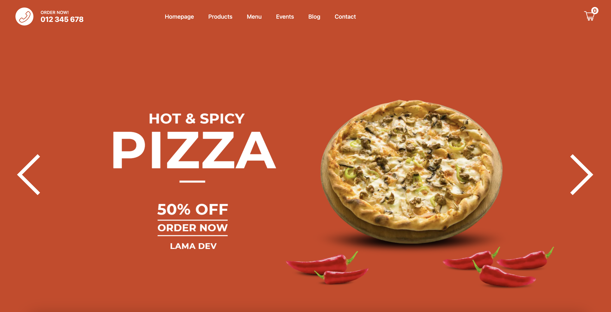
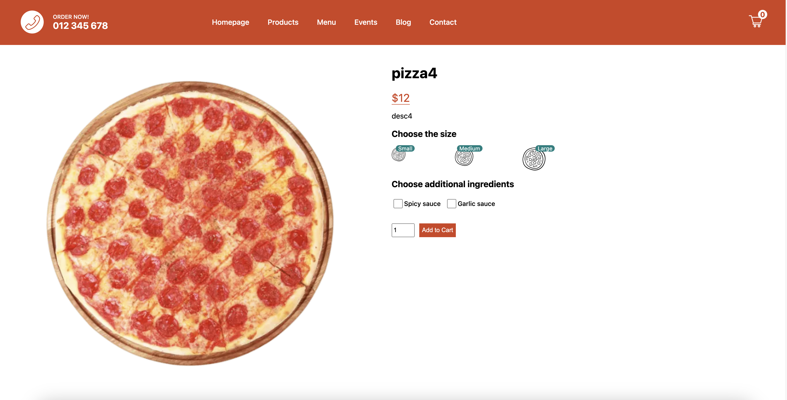

# Pizza Order - ReactJS

## 📷 Screenshot

  

  

## 📝 Project Description

Pizza order displays a list of pizzas from a mongodb database. Has the options to add a pizza to the cart.

## 📚 Technologies

- [ReactJS](https://reactjs.org/)
- [NextJS](https://nextjs.org/)
- [MongoDB](https://www.mongodb.com/atlas)
